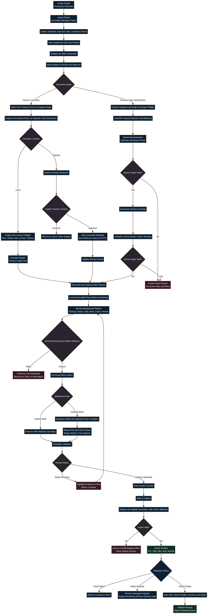

# MiniFigure 3D Studio — Stage 1 Approval Package

**Author:** Manus AI  
**Date:** 2026-08-26  
**Decision requested:** Approve the proposed architecture and Stage 2 entry conditions, or request revisions.  
**Implementation status:** No application source code has been written and no application runtime test is claimed.

## 1. Executive Recommendation

MiniFigure 3D Studio is technically feasible as a **local-first PySide6 desktop application that supervises Hunyuan-compatible generation workers, Blender, and COLMAP as separate processes**. The desktop shell should own project state, consent, orchestration, progress, recovery, validation, and user-facing truth. Heavy engines should never be imported directly into the GUI process.

The proposed design supports the required Fast AI and Accurate Scan workflows while preserving one shared project/artifact model, non-destructive masks, an offline Three.js viewer, Blender repair, separate PBR and filament-color paths, printability findings, and transactional exports.

Approval should be **conditional** on resolving four product-level decisions: Hunyuan3D territorial rights, background-removal model rights, the Qt/Blender compliance path, and qualified “Ready to Print” wording.

## 2. Most Important Findings

### 2.1 Hunyuan3D Cannot Be a Universal Default Under the Reviewed License

The Hunyuan3D 2.1 community license expressly excludes the European Union, United Kingdom, and South Korea from its licensed territory and restricts use/distribution outside that territory.[1] The universal Windows installer must therefore not bundle or enable Hunyuan3D 2.1 under that license for excluded territories. The architecture uses a separate territory/license-gated engine package and requires either separate rights or a compliant alternative adapter before the product claims worldwide local AI support.

### 2.2 Hunyuan Requires Runtime Isolation and Honest Input Wording

The official Hunyuan3D 2.1 documentation shows one image supplied to shape generation and one image path to texture generation; it reports approximately 10 GB VRAM for shape, 21 GB for texture, and 29 GB combined, and it documents a Python 3.10/PyTorch/CUDA-tested stack.[2] The Python 3.11 desktop shell should launch Hunyuan in a separate managed environment. The interface should say that one selected primary image enters the generator and other photographs are separate visual references unless a future adapter declares genuine multi-image conditioning.

### 2.3 Library License and Model License Are Separate

The rembg software is MIT-licensed, but its own documentation warns that model weights carry independent terms and that the current default BRIA model requires paid commercial terms.[3] The product must approve a specific segmentation model by source, revision, hash, quality, and redistribution rights; it must not inherit a library default silently.

### 2.4 Qt and Blender Need Explicit Compliance Boundaries

Qt's official LGPL guidance describes notice, source/offer, replacement/relinking, and other obligations, while Qt WebEngine also includes Chromium and its third-party licenses.[4] [5] Blender's official license page states that published scripts using Blender's Python API must use a GPL-compatible license.[6] The proposed structure therefore keeps the desktop shell, Qt distribution, Blender scripts, optional engines, and notices distinct.

### 2.5 Export and Print Status Must Be Evidence-Based

A created file is not a valid deliverable until it reopens, contains non-empty geometry, has expected dimensions, and preserves required part/material semantics. 3MF multi-material output should use the Materials and Properties Extension through lib3mf, followed by independent read/validation and actual Orca Slicer/Creality Print fixtures.[7] [8]

“Ready to Print” should mean that the model passed the checks implemented by the selected MiniFigure 3D Studio version/profile. It must not be presented as a guarantee of physical print success.

## 3. Proposed Architecture at a Glance

| Boundary | Responsibility |
|---|---|
| PySide6 desktop shell | UI, RTL/LTR, project state, orchestration, consent, progress, errors, recovery, reports. |
| Image worker | Decode, normalize, quality analysis, duplicates, background mask adapter. |
| Hunyuan worker | Optional local shape/texture engine in a separate runtime, subject to capability and license gates. |
| COLMAP process chain | Feature extraction, matching, sparse cameras/points, dense cloud, mesh, and real failure reporting. |
| Blender background process | Backup, cleanup, repair, style transforms, fragile-feature operations, base, scale, previews, and supported exports. |
| Offline viewer | Bundled Three.js inside Qt WebEngine with remote networking and arbitrary navigation denied. |
| Project workspace | Atomic versioned manifest, immutable artifacts, checkpoints, reports, redacted logs, staging. |
| Export validators | Reopen and verify STL, GLB, OBJ, BLEND, and 3MF before atomic finalization. |

## 4. End-to-End Data Flow

Fast AI and Accurate Scan remain separate pipelines until they produce a raw mesh. They then share Blender processing, appearance/color review, printability validation, and export. External transfer is a visible branch behind provider disclosure and explicit consent. Failure paths never promote a stale, empty, inherited, or placeholder artifact.

## 5. User-Interface Structure

The interface preserves the requested fifteen steps while grouping them into Project, Photos, Design, Build, and Verify/Deliver. Long tasks appear in a persistent Activity Center with real progress where engines provide it, an indeterminate named operation where they do not, cancellation, capability-gated Pause, retry, safe logs, expandable technical details, and redacted error copying.

Arabic RTL mirrors navigation and text layout but does not invert model axes, camera rotation semantics, file extensions, or signed numbers. Arabic project paths are mandatory integration cases for every external process and export.

## 6. Approval Decisions

| Decision | Recommended approval |
|---|---|
| Overall architecture | Approve the local-first modular monolith with external worker/process boundaries and versioned protocols. |
| Hunyuan distribution | Approve only as a separate territory/license-gated package; require a compliant alternative or separate rights for excluded territories. |
| Hunyuan runtime | Approve a separate engine environment; reject importing the upstream stack into the Python 3.11 GUI. |
| Supplementary photos | Approve one primary generator input plus separate reference analysis unless an adapter explicitly supports multi-image conditioning. |
| Background removal | Approve the adapter architecture; defer model approval until commercial rights and quality are verified. |
| Qt | Approve dynamic LGPL-compliant packaging for development unless commercial terms are selected; require qualified release review. |
| Blender | Approve external/background execution and separate GPL-compatible script source distribution. |
| 3MF | Approve lib3mf with read-back and slicer compatibility fixtures. |
| Secure deletion wording | Approve Delete Project plus best-effort Enhanced Local Cleanup; reject claims of guaranteed SSD/device sanitization. |
| Print readiness | Approve three derived states with a clear limitation that readiness means passing declared checks, not guaranteed print outcome. |
| Installer architecture | Approve a core EXE/installer plus optional signed engine/model packages; reject one giant single-file bundle. |
| Stage progression | Approve a hard stop after Stage 2 until real tests pass and the working MVP is reviewed. |

## 7. Stage 1 Deliverables

| Deliverable | File |
|---|---|
| Architecture document | `architecture_document.md` |
| System architecture diagram | `system_architecture.png` and `system_architecture.mmd` |
| End-to-end data-flow diagram | `data_flow.png` and `data_flow.mmd` |
| UI workflow diagram | `ui_workflow.png` and `ui_workflow.mmd` |
| Diagram explanation | `diagrams.md` |
| User-interface design | `ui_ux_design.md` |
| Dependency and license register | `dependency_license_register.md` |
| Security and privacy plan | `security_privacy_plan.md` |
| Implementation roadmap | `implementation_roadmap.md` |
| Risk register | `risk_register.md` |
| Proposed project structure | `proposed_project_structure.md` |
| Requirements traceability | `requirements_traceability.md` |

## 8. Stage 2 Entry Conditions

Stage 2 may begin after architecture approval and explicit acceptance or resolution of the critical decisions above. The first implementation work should establish the repository/toolchain, atomic project storage and recovery, the process protocol and fake engines, then the minimal UI shell. Real image, AI, Blender, and exporter integrations should be added as vertical slices with failure tests.

A legally usable generation engine is part of the Stage 2 definition of done. If Hunyuan cannot be used in the intended development/distribution territory, the adapter architecture remains valid but a different engine must satisfy the MVP requirement.

## 9. Verification Performed in Stage 1

Stage 1 verification covers documentation completeness, source cross-checking, diagram rendering, and visual diagram inspection. The system architecture, data flow, and UI workflow diagrams were rendered successfully and inspected for clipping, branch continuity, readable labels, and terminal outcomes. The requirements traceability matrix maps each specification group to a planned component, stage, and future evidence.

No application tests were run because the user explicitly required Stage 1 only and requested architecture approval before application code. The package makes no claim that Hunyuan, Blender, COLMAP, segmentation, 3MF slicer interoperability, installer packaging, or physical printing has already passed.

## 10. Requested Response

Please approve one of the following:

| Option | Meaning |
|---|---|
| **Approve Stage 1** | The proposed architecture, UI, data flow, security/privacy model, repository structure, and roadmap become the baseline for Stage 2. |
| **Approve with changes** | List required revisions; Stage 2 remains blocked until this package is updated. |
| **Do not approve** | Stage 2 does not begin. |

If Stage 1 is approved, the implementation environment should be bound to a project folder before Stage 2 so development can proceed in the intended location.

## References

[1]: https://raw.githubusercontent.com/Tencent-Hunyuan/Hunyuan3D-2.1/main/LICENSE "Tencent Hunyuan 3D 2.1 Community License"
[2]: https://github.com/Tencent-Hunyuan/Hunyuan3D-2.1 "Tencent Hunyuan3D 2.1 Repository"
[3]: https://github.com/danielgatis/rembg "rembg Repository and Model-License Warning"
[4]: https://www.qt.io/development/open-source-lgpl-obligations "Qt GPL and LGPL Obligations"
[5]: https://doc.qt.io/qt-6/qtwebengine-licensing.html "Qt WebEngine Licensing"
[6]: https://www.blender.org/about/license/ "Blender License"
[7]: https://3mf.io/spec/ "3MF Specification Suite"
[8]: https://github.com/3MFConsortium/lib3mf "lib3mf Repository"
