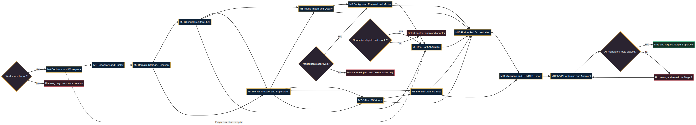

# MiniFigure 3D Studio — Stage 2 Implementation Plan

**Author:** Manus AI  
**Date:** 2026-08-26  
**Stage 1 status:** Approved  
**Stage 2 status:** Implementation planning complete; application coding has not started  
**Decision requested:** Approve this plan and bind the intended development folder before source creation

## 1. Objective

Stage 2 will produce a working Fast AI MVP on Windows through risk-first vertical slices. The MVP will create/recover projects, import and assess 1–6 images, select one honest primary generator input, remove/correct the background, run one legally usable generation adapter, preview the raw model offline, process it through Blender, display minimum truthful validation, and export STL/GLB through independent reopen checks.

Accurate Scan, full color separation and 3MF, complete printability analysis, advanced styles, production signed installer, and complete Arabic localization remain Stage 3. They are not represented as working in Stage 2.

## 2. Critical Path

| Sequence | Milestone | Exit proof |
|---:|---|---|
| M0 | Decisions and workspace | Bound repository and explicit license/engine/environment decisions. |
| M1 | Repository and quality | Static checks, schemas, synthetic assets, and no-secret policy work on Windows. |
| M2 | Domain/storage/recovery | Atomic project state, immutable artifacts, crash recovery, safe deletion inventory. |
| M3 | Bilingual shell | Project UI, theme, navigation, critical RTL, Arabic path support. |
| M4 | Worker supervision | Fake success/failure/hang/child/malformed/stale/cancel cases pass without UI freeze. |
| M5 | Images | Safe import, duplicate/blur/exposure/resolution findings, view assignment, primary selection. |
| M6 | Masks | Approved model or manual fallback, immutable revisions, undo/redo, restart recovery. |
| M7 | Viewer | Bundled offline Three.js, secure bridge, GLB/parts/view modes/screenshots. |
| M8 | Blender | Real background self-test, cleanup/base/scale/Z=0/four renders using synthetic meshes. |
| M9 | Generator | One real legally usable engine passes success, failure, cancel, resource, and stale-output checks. |
| M10 | Orchestration | Real image-to-processed-model flow with recovery and truthful progress. |
| M11 | Validation/export | Qualified three-state result and reopened, validated, atomic STL/GLB outputs. |
| M12 | Hardening | Windows/offline/privacy/Arabic/package evidence and Stage 2 approval candidate. |

## 3. Non-Negotiable Gates

| Gate | Plan rule |
|---|---|
| Workspace | No application source is created until the intended folder/repository is bound or explicitly provided. |
| Stage progression | A later behavior-changing batch does not start while a mandatory prerequisite test fails. |
| Generator | A fake adapter establishes the contract but cannot satisfy the MVP. One real legally usable adapter must work. |
| Hunyuan | Optional and isolated; enabled only where the license/territory, hardware, package, and self-test gates pass. The reviewed community license excludes the EU, UK, and South Korea.[1] |
| Primary input | Single-image adapters receive only the selected primary image; supplementary photos do not enter engine staging. |
| Background model | Exact weights require source, revision, hash, license, quality benchmark, and approval. Software license is not a proxy for weight rights.[2] |
| Responsiveness | Long operations run outside the GUI thread; heartbeat and cancellation tests are mandatory. |
| Truthful success | Process exit code is insufficient. Current-run result schema, files, hashes, reopen checks, and semantics must pass. |
| Blender | External background execution with separate GPL-compatible script source.[3] [4] |
| Viewer | All JavaScript/assets are local; networking, navigation, popups, arbitrary file access, and broad bridge calls are denied. |
| Privacy | Local workflow passes with networking denied; images and secrets are excluded from logs/diagnostics. |
| Export | Write to staging, reopen/validate, then atomic finalize. Invalid output never becomes success. |
| Approval | M12 ends by stopping and requesting Stage 2 approval. Stage 3 does not start automatically. |

## 4. Delivery Units

The implementation is split into **27 file batches**. Each batch has exact files, paired tests, commands/results, changed-file list, security/license impact, rollback point, and a gate decision.

| Batch range | Scope |
|---|---|
| B01–B06 | Repository, tests, schemas, domain, filesystem, project recovery, logging/secrets. |
| B07–B11 | Shell, project UI, worker protocol, fake processes, Activity Center, error UI. |
| B12–B17 | Image import/quality, background-removal contract/approved model, mask editor. |
| B18–B21 | Offline viewer and real Blender cleanup vertical slice. |
| B22–B24 | Generator contract, one real adapter, end-to-end orchestration. |
| B25–B26 | Minimum validation and transactional STL/GLB export. |
| B27 | Windows development package smoke, documentation, evidence, closeout. |

The exact order and file paths are defined in `05_file_by_file_build_sequence.md`. Stage 3 modules are not created as empty placeholders.

## 5. Environment Architecture

| Runtime | Stage 2 rule |
|---|---|
| Core desktop | One pinned Python 3.11 x64/PySide6 environment. |
| Background inference | Worker process, ONNX Runtime CPU baseline after model approval. |
| Hunyuan/alternative generator | Separate environment/process and versioned protocol; never imported into the GUI. |
| Blender | One supported discovered Blender LTS executable and separate scripts. |
| Viewer | Node/pnpm build-time only; application ships pinned local static assets. |
| Windows tests | Native Windows 11 mandatory; Windows 10 clean smoke needed for that support claim. |
| Packaging | Directory-based PyInstaller development bundle in Stage 2; final signed installer is Stage 3. |

The upstream Hunyuan documentation supports runtime isolation by documenting a separate Python/PyTorch/CUDA-oriented stack and material VRAM demands.[5] Exact core and engine versions will be frozen only after clean native Windows compatibility tests.

## 6. Test Scope

The matrix defines tests across domain/schema, filesystem/recovery, UI/RTL, process supervision, image quality, masks, offline viewer, Blender, generator, orchestration, validation, export, privacy/security, and package smoke.

| Rule | Meaning |
|---|---|
| Result vocabulary | Passed, Failed, Skipped, Not Run, Blocked. |
| Gate satisfaction | Only Passed satisfies a mandatory gate. |
| Environment truth | A portable mock cannot satisfy native Windows, Blender, GPU, or clean-package evidence. |
| Fixtures | Synthetic/licensed assets only in repository. |
| Failure tests | Missing engine, insufficient resource, process crash, child hang, stale output, malformed result, permission denied, disk full, and cancellation are mandatory where applicable. |
| Stage 3 trace | COLMAP, keychain, color separation, 3MF, and advanced validator tests remain explicitly deferred rather than silently omitted. |

## 7. Owner Inputs Required Before Related Implementation

| Input | Needed before |
|---|---|
| Bound development folder or repository path | B01 source creation. |
| Intended development/distribution territories | Hunyuan installation/execution. |
| Product-shell license or private-development status | Root `LICENSE` and public release policy. |
| Qt LGPL-oriented or commercial path | Release packaging; development can follow the approved LGPL-oriented architecture. |
| Background model candidates and approval owner | B16 real automatic background removal. |
| Real generator choice | B23 real adapter and Stage 2 completion. |
| Windows/GPU/Blender environment availability | Native milestone evidence. |

The recommended defaults are: dynamic LGPL-oriented Qt architecture for development, supported user-installed Blender LTS discovery first, ONNX CPU mask baseline after model approval, Hunyuan only when eligible, and a compliant alternative/provider if it is not.

## 8. First Implementation Action After Approval

After this plan is approved and the workspace is bound, implementation begins with **M0 workspace reconnaissance** and then **B01 only**. B01 creates root metadata, license/status documents, ignore/attribute rules, `.env.example`, `pyproject.toml`, direct requirement inputs, and the Python version record. It then runs configuration parsing, secret scanning, ignore tests, and a native Windows dependency-resolution check.

B02 does not start until B01 passes and a clean rollback commit exists.

## 9. Planning Deliverables

| Deliverable | File |
|---|---|
| Executive implementation plan | `STAGE2_IMPLEMENTATION_PLAN.md` |
| Approved-baseline assumptions and unresolved inputs | `01_baseline_and_assumptions.md` |
| Full milestone backlog and gates | `02_mvp_backlog_and_gates.md` |
| Environment and dependency plan | `03_environment_and_dependency_plan.md` |
| Engine/release-safe strategy | `04_engine_and_release_strategy.md` |
| File-by-file build sequence | `05_file_by_file_build_sequence.md` |
| Test matrix | `06_stage2_test_matrix.md` |
| Execution runbook | `07_stage2_execution_runbook.md` |
| Milestone graph | `stage2_dependency_graph.png` and editable `.mmd` source |
| Quality report | `quality_report.md` |

## 10. Approval Requested

Please approve one of these outcomes:

| Option | Effect |
|---|---|
| **Approve Stage 2 plan and start implementation** | Bind/provide the folder and complete M0 inputs; implementation starts at B01. |
| **Approve with changes** | List revisions; application coding remains blocked until the plan is updated. |
| **Planning only; do not code** | Keep this as the implementation baseline without creating application source. |

## References

[1]: https://raw.githubusercontent.com/Tencent-Hunyuan/Hunyuan3D-2.1/main/LICENSE "Tencent Hunyuan 3D 2.1 Community License"
[2]: https://github.com/danielgatis/rembg "rembg Repository and Model-License Warning"
[3]: https://docs.blender.org/manual/en/latest/advanced/command_line/arguments.html "Blender Command-Line Arguments"
[4]: https://www.blender.org/about/license/ "Blender License"
[5]: https://github.com/Tencent-Hunyuan/Hunyuan3D-2.1 "Tencent Hunyuan3D 2.1 Repository"
