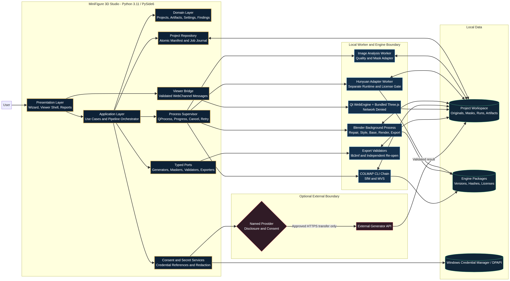
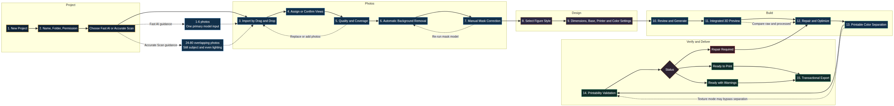

# MiniFigure 3D Studio — Architecture and Data-Flow Diagrams

**Author:** Manus AI  
**Status:** Stage 1 proposal

## 1. System Architecture

The system architecture diagram shows the desktop shell as the owner of presentation, use cases, domain policy, process supervision, project persistence, consent, secret references, and the viewer bridge. Heavy engines remain outside the GUI process. The Hunyuan, Blender, and COLMAP workers access only staged project artifacts and versioned requests. The optional external API boundary is reachable only through a named disclosure and consent gate.

This topology reflects the engines' official interfaces and runtime realities. Blender supports background command-line Python execution, COLMAP exposes a scriptable CLI for Structure-from-Motion and Multi-View Stereo, and Hunyuan3D documents a separate model stack with significant GPU requirements.[1] [2] [3]

## 2. End-to-End Data Flow

The data-flow diagram begins with permission acknowledgment and immutable photo import, then runs quality analysis, view assignment, masking, and manual review. It branches into Fast AI and Accurate Scan paths and converges on a raw mesh artifact. Fast AI explicitly selects one primary input for the Hunyuan adapter, while supplementary photos remain a separate color-reference workflow unless a future adapter declares real multi-image support.

The external-generator branch displays the privacy boundary: the user sees the provider, decides whether to consent, and transmits only the minimum prepared data when approved. Declining returns to a local or different adapter without manufacturing a result.

Accurate Scan runs feature extraction, matching, sparse reconstruction, measured camera coverage, dense reconstruction, fusion, and meshing. Sparse or dense failures terminate in an actual failure report and corrective actions. COLMAP's official scope includes camera poses, sparse structure, dense point clouds, and meshes, which supports this stage design.[2]

Both modes commit an immutable raw artifact before Blender processing. The pipeline then separates PBR texture preservation from printable filament-color assignment, validates printability, loops blocking findings back to repair, writes selected exports to staging, reopens them, and finalizes only valid output. Retention choices distinguish keeping the project, deleting managed originals while explaining remaining derived likeness data, and deleting the project with a receipt.

## 3. User-Interface Workflow

The UI workflow preserves all fifteen required steps while grouping them into Project, Photos, Design, Build, and Verify/Deliver phases. Fast AI and Accurate Scan guidance appears immediately after mode choice. Quality and mask stages have visible correction loops. Repair Required returns to repair, while Ready to Print and Ready with Warnings converge on transactional export.

Texture mode can bypass printable color separation, but both paths still reach printability validation because textures and printable filament assignments solve different problems. The 3MF specification provides explicit material/property semantics for multi-material data rather than treating a PBR image texture as a standard filament plan.[4]

## 4. Diagram Conventions

| Visual convention | Meaning |
|---|---|
| Navy and blue actions | Normal local workflow or processing stage. |
| Gold-bordered diamonds | Decision or validation gate. |
| Red actions | Failure, blocking repair, or invalid result. |
| Green actions | Valid finalization or confirmed terminal outcome. |
| Dotted connector | Guidance, review loop, or optional bypass rather than ordinary forward execution. |
| Cylinder | Persistent local data or protected storage. |

## 5. Editable Sources

The package includes Mermaid source files for all three diagrams:

| Diagram | Source | Render |
|---|---|---|
| System architecture | `system_architecture.mmd` | `system_architecture.png` |
| End-to-end data flow | `data_flow.mmd` | `data_flow.png` |
| UI workflow | `ui_workflow.mmd` | `ui_workflow.png` |

The data-flow render is intentionally tall to preserve readable branch detail. The UI render is intentionally wide to preserve the left-to-right fifteen-step sequence. The sources allow later reformatting for a slide deck or print layout without losing semantics.

## References

[1]: https://docs.blender.org/manual/en/latest/advanced/command_line/arguments.html "Blender Command-Line Arguments"
[2]: https://colmap.github.io/index.html "COLMAP — Structure-from-Motion and Multi-View Stereo"
[3]: https://github.com/Tencent-Hunyuan/Hunyuan3D-2.1 "Tencent Hunyuan3D 2.1 Repository"
[4]: https://3mf.io/spec/ "3MF Specification Suite"
